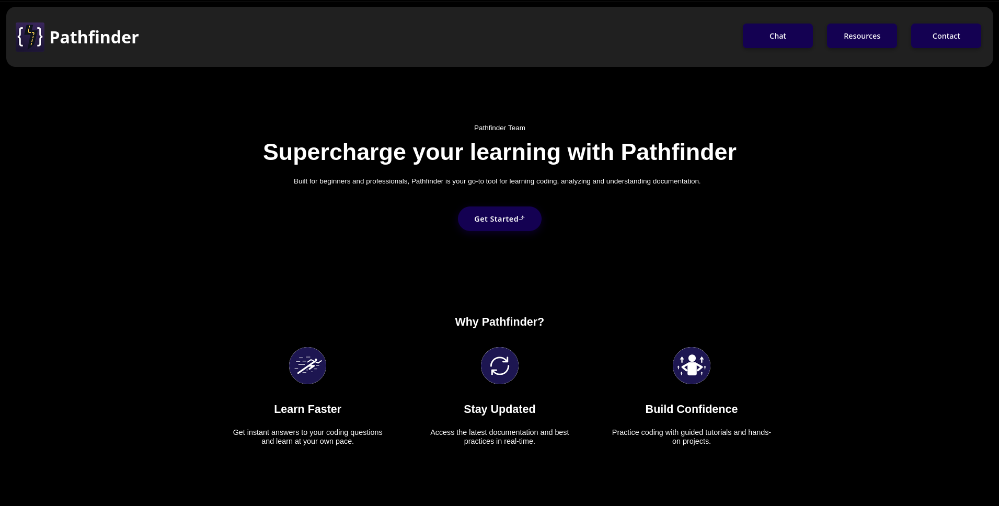
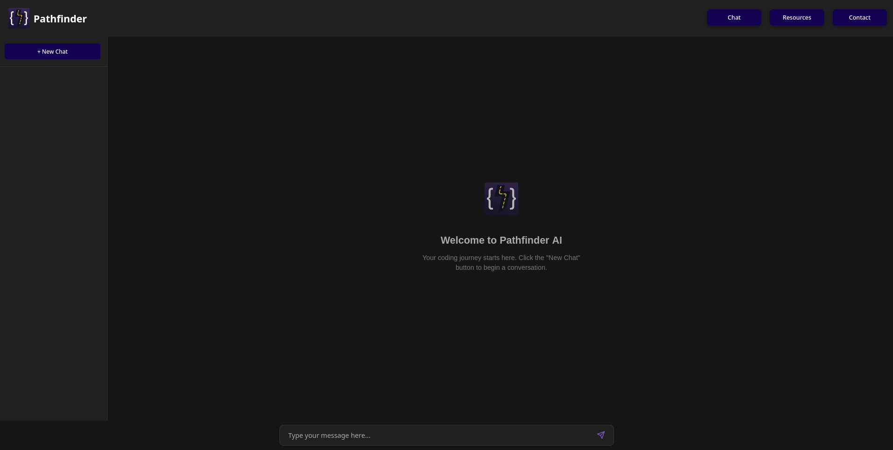
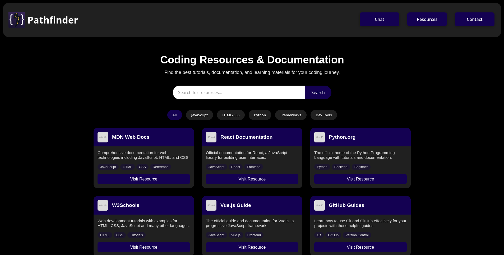
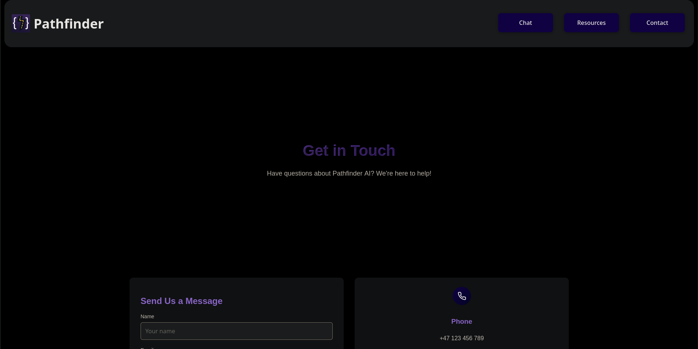

# PathfinderAI

**PathfinderAI** is a specialized AI-powered programming tutor designed as part of a high school project. Conceived with a company and brand image in mind, PathfinderAI serves as a knowledgeable guide for students and aspiring programmers—offering code explanations, examples, and tailored assistance in a user-friendly interface.

## Project Concept

The idea behind PathfinderAI is to act as a virtual mentor, guiding users through programming concepts and coding challenges. The AI assistant is driven by DeepSeek as its backend, enhanced with custom instructions to provide educational and insightful responses. The name "Pathfinder" reflects its purpose: to help users find their way through the world of programming.

## Features

- **AI Tutoring:** Ask questions, get explanations, and see code examples tailored to your needs.
- **Handcrafted Frontend:** Every page is built from scratch using only HTML, CSS, and JavaScript—no frameworks involved.
- **Custom Branding:** Sleek, modern design with a black, gray, and purple color palette for a unique, professional look.
- **Simple Setup:** Easily run PathfinderAI locally with just a few steps.

## Screenshots






## Getting Started

1. **Clone or Download the Repository:**
    ```bash
    git clone https://github.com/artyomkotov/PathfinderAI.git
    ```
    Or download the ZIP and extract it.

2. **Get a DeepSeek API Key:**
   - Sign up and generate your DeepSeek API key from their [official site](https://platform.deepseek.com/).

3. **Configure the API Key:**
   - Open `chat-script.js` in the project directory.
   - Find the section where the API key is needed and paste your DeepSeek API key as instructed in the code.

4. **Run Locally:**
   - Open `index.html` in your favorite browser.
   - Start exploring and chatting with PathfinderAI!

## Technologies Used

- **HTML, CSS, JavaScript:** All site components are written in plain HTML, CSS, and JS. No frameworks or libraries were used.
- **DeepSeek API:** Powers the AI responses with custom instructions for tutoring.

## Branding

- **Color Scheme:** Black, gray, and purple for a modern, tech-inspired look.
- **Handcrafted Design:** Every element and page styled and coded manually.

## Credits

- **Frontend, Backend & Design:** [@artyomkotov](https://github.com/artyomkotov)
- **AI part of the Backend:** DeepSeek API

## License

This project is for educational purposes as a high school assignment. Feel free to use, modify, or build upon it for learning and non-commercial purposes.

---

> PathfinderAI – Your guide through the world of programming.
